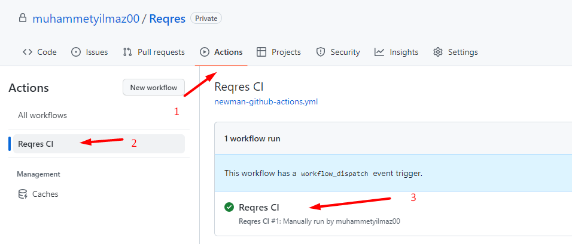

**Reqres API automation Postman Collection**

BaseUrl is https://reqres.in/

The points given below are used to create this repository
 - 5 different API Request
 - Data driven test using external data source
 - Schema validation
 - Environment configuration
 - CI integration

**Run Workflows of this collection?**
- Go to Actions tab
- Click Reqres CI workflow
- Click the job

**Report**

The report will be under and at the end of the job
Download and Open the report

Example Report:

